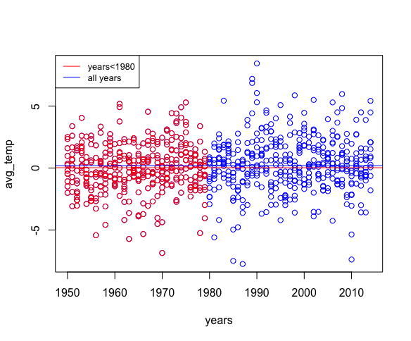

```{r setup, include=FALSE}
knitr::opts_chunk$set(echo = TRUE)
```

\newpage

# BDA1 - Spark - Exercises

*Every .txt output will be attached as separate file.* 

In this set of exercises you will work exclusively with Spark. This means that in your programs, you only need to create the **SparkContext** .

In a number of exercises you will be asked to calculated temperature averages (daily and monthly). These are not always computed according to the standard definition of ???average???. In this domain the daily average temperature is calculated by averaging the daily measured maximum and the daily measured minimum temperatures. The monthly average is calculated by averaging the daily maximums and minimums for that month. For example, to get the monthly average for October, take maximums and minimums for each day, sum them up and divide by 62 (which is the same as taking the daily averages, summing them up and divide by the number of days).

## Assignments

## Assignments 1
- 1) What are the lowest and highest temperatures measured each year for the period 1950-2014. Provide the lists sorted in the descending order with respect to the maximum temperature. In this exercise you will use the **temperature-readings.csv**  file.

Code - Min & Max:
```{r, eval=FALSE}
# here come the code for assigment 1a - max
from pyspark import SparkContext
from pyspark.sql import SQLContext, Row  
from pyspark.sql import functions as F
sc =SparkContext()
sqlContext=SQLContext(sc)

temp = sc.textFile("/user/x_phiho/data/temperature-readings.csv")

lines = temp.map(lambda line: line.split(";"))

year_temp = lines.map(lambda x: (x[1][0:4], float(x[3])))

year_temp = year_temp.filter(lambda x: int(x[0]) >= 1950 and int(x[0]) <= 2014)

year_temp_max = year_temp.reduceByKey(lambda x,y :x if x>=y else y)

year_temp_max_sort = year_temp_max.sortBy(ascending=False,keyfunc=lambda k:k[1])

min_temperatures = year_temp.reduceByKey(lambda x,y :x if x<=y else y)

year_temp_max_sort = min_temperatures.sortBy(ascending=False,keyfunc=lambda k:k[1])


year_temp_max_sort.saveAsTextFile("results/A1a_min")

year_temp_max_sort.saveAsTextFile("results/A1a_max")
```


Output - Max:
```{r, eval=FALSE}
# this are the first rows of the output
(u'1975', 36.1)
(u'1992', 35.4)
(u'1994', 34.7)
(u'2010', 34.4)
(u'2014', 34.4)
(u'1989', 33.9)
(u'1982', 33.8)
(u'1968', 33.7)
(u'1966', 33.5)
(u'1983', 33.3)
(u'2002', 33.3)
(u'1970', 33.2)
(u'1986', 33.2)
```


Output - Min:
```{r, eval=FALSE}
# here are the last rows of the output
(u'1985', -43.4)
(u'1959', -43.6)
(u'2001', -44.0)
(u'1979', -44.0)
(u'1981', -44.0)
(u'1965', -44.0)
(u'1986', -44.2)
(u'1971', -44.3)
(u'1956', -45.0)
(u'1980', -45.0)
(u'1967', -45.4)
(u'1987', -47.3)
(u'1978', -47.7)
(u'1999', -49.0)
(u'1966', -49.4)

```

\newpage
## Assignments 1a
- a) Extend the program to include the station number (*not the station name*) where the maximum/minimum temperature was measured.

Code - Min & Max:
```{r, eval=FALSE}
# here come the code for assigment 1a - max
from pyspark import SparkContext
from pyspark.sql import SQLContext, Row  
from pyspark.sql import functions as F
sc =SparkContext()
sqlContext=SQLContext(sc)

temp = sc.textFile("/user/x_phiho/data/temperature-readings.csv")

lines = temp.map(lambda line: line.split(";"))

year_temp = lines.map(lambda x: (x[1][0:4],( float(x[3]),x[0])))

year_temp = year_temp.filter(lambda x: int(x[0]) >= 1950 and int(x[0]) <= 2014)

#############################
max_temperatures1= year_temp.reduceByKey(lambda x,y :x if x>=y else y)

max_temperaturesSorted1=max_temperatures1.sortBy(ascending=False,keyfunc=lambda k:k[1][0])

t=max_temperaturesSorted1.map(lambda x: (x[0], float(x[1][0]),x[1][1]))

#############################

min_temperatures1= year_temp.reduceByKey(lambda x,y :x if x<=y else y)

min_temperaturesSorted1=min_temperatures1.sortBy(ascending=True,keyfunc=lambda k:k[1][0])

t1=min_temperaturesSorted1.map(lambda x: (x[0], float(x[1][0]),x[1][1]))


t.saveAsTextFile("results/A1a_max_part2_v2")
t1.saveAsTextFile("results/A1a_min_part2_v2")

```

Output - Max:
```{r, eval=FALSE}
# here comes the output of the first rows
(u'1975', 36.1, u'86200')
(u'1992', 35.4, u'63600')
(u'1994', 34.7, u'117160')
(u'2010', 34.4, u'75250')
(u'2014', 34.4, u'96560')
(u'1989', 33.9, u'63050')
(u'1982', 33.8, u'94050')
(u'1968', 33.7, u'137100')
(u'1966', 33.5, u'151640')
(u'2002', 33.3, u'78290')

```


Output - Min:
```{r, eval=FALSE}
# here comes the output of the first rows
(u'1966', -49.4, u'179950')
(u'1999', -49.0, u'192830')
(u'1978', -47.7, u'155940')
(u'1987', -47.3, u'123480')
(u'1967', -45.4, u'166870')
(u'1956', -45.0, u'160790')
(u'1980', -45.0, u'191900')
(u'1971', -44.3, u'166870')
(u'1986', -44.2, u'167860')

```


\newpage
## Assignments 1b
b) (not for the SparkSQL lab) Write the non-parallelized program in Python to find the maximum temperatures for each year without using Spark. In this case you will run the program using:
** python script.py **

Code:
```{r, eval=FALSE}
# here come the code for assigment 1b
import csv
import time

start = time.time()

maxtemp = {}
mintemp = {}

for i in range(1950,2015):
	maxtemp[i] = (-100, "")
	minTemp[i] = (+100, "")

with open("../../hadoop_examples/shared_data/temperature-readings.csv") as f:
	for line in f:
		values = line.split(";")
		year = int(values[1][:4])
		if year >= 1950 and year <= 2014:
			if maxtemp[year][0] < float(values[3]):
				maxtemp[year] = (float(values[3]), values[0])
			if mintemp[year][0] > float(values[3]):
				mintemp[year] = (float(values[3]), values[0])
			
		
temp_max_sorted = sorted(maxTemp.items(), key = lambda tup: tup[1][0], reverse=True)
temp_min_sorted = sorted(minTemp.items(), key = lambda tup: tup[1][0], reverse=True)

print("Max Temp")
print("\n".join(map(str, temp_max_sorted)))
print("Min Temp")
print("\n".join(map(str, temp_min_sorted)))
print("Time:")
print(time.time()-start)
```

Output:
```{r, eval=FALSE}
# here comes the output

Max Temp
(1975, (36.1, '86200'))
(1992, (35.4, '63600'))
(1994, (34.7, '117160'))
(2010, (34.4, '75250'))
(2014, (34.4, '96560'))
(1989, (33.9, '63050'))
(1982, (33.8, '94050'))
(1968, (33.7, '137100'))

Min Temp
(2001, (-44.0, '112530'))
(1986, (-44.2, '167860'))
(1971, (-44.3, '166870'))
(1956, (-45.0, '160790'))
(1980, (-45.0, '191900'))
(1967, (-45.4, '166870'))
(1987, (-47.3, '123480'))
(1978, (-47.7, '155940'))
(1999, (-49.0, '192830'))
(1966, (-49.4, '179950'))

Time:
236.919939041
```


This program will read the local file (not from HDFS). The local file is available under
** /nfshome/hadoop_examples/shared_data/temperatures-big.csv. **

How does the runtime compare to the Spark version? Use logging (add the --conf spark.eventLog.enabled=true flag) to check the execution of the Spark program. Repeat the exercise, this time using temperatures-big.csv file available on hdfs. Explain the differences and try to reason why such runtimes were observed.

\newpage
## Assignments 2
- 2) Count the number of readings for each month in the period of 1950-2014 which are higher than 10 degrees. Repeat the exercise, this time taking only distinct readings from each station. That is, if a station reported a reading above 10 degrees in some month, then it appears only once in the count for that month.
In this exercise you will use the **temperature-readings.csv** file. The output should contain the following information:
Year, month, count

## Assignments 2 a)
Code:
```{r, eval=FALSE}
from pyspark import SparkContext
from pyspark.sql import SQLContext, Row  
from pyspark.sql import functions as F
sc =SparkContext()
sqlContext=SQLContext(sc)

temp=sc.textFile("/user/x_phiho/data/temperature-readings.csv")

lines=temp.map(lambda line: line.split(";"))


years=lines.map(lambda x: ( (x[1][0:4],x[1][5:7]),float(x[3]) ))

years=years.filter(lambda x: int(x[0][0]) >= 1950 and int(x[0][0]) <= 2014)

#############################
tempsOver= y.filter(lambda x : x[1] >= 10)

tempsOver_unpack=tempsOver.map(lambda x: ( (x[0][0], x[0][1]),1))

tempsOver10=tempsOver_unpack.reduceByKey(lambda x,y : x+y).sortByKey()

tempsOver10.saveAsTextFile("results/A2a")
```

Output:
```{r, eval=FALSE}
# this are the first rows of the output
((u'1950', u'03'), 97)
((u'1950', u'04'), 380)
((u'1950', u'05'), 2958)
((u'1950', u'06'), 4953)
((u'1950', u'07'), 5874)
((u'1950', u'08'), 6015)
((u'1950', u'09'), 3791)
((u'1950', u'10'), 1381)
((u'1950', u'11'), 2)
((u'1950', u'12'), 1)
((u'1951', u'02'), 1)
```

## Assignments 2 b) - distinct
Code:
```{r, eval=FALSE}
from pyspark import SparkContext
from pyspark.sql import SQLContext, Row  
from pyspark.sql import functions as F
sc =SparkContext()
sqlContext=SQLContext(sc)

temp = sc.textFile("/user/x_phiho/data/temperature-readings.csv")

lines = temp.map(lambda line: line.split(";"))

year = lines.map(lambda x: (x[1][0:7], (x[0], float(x[3]))))

year = year.filter(lambda x: int(x[0][0:4])>=1950 and int(x[0][0:4])<=2014)
year = year.filter(lambda x: float(x[1][1]) >= 10)

month = y.map(lambda x: (x[0], x[1][0]))
###
month_unique = month.distinct()
unique_each_month = month_unique.map(lambda x: x[0])

month_count = unique_each_month.map(lambda s: (s,1))
counts = month_count.reduceByKey(lambda a,b: a+b)

counts.saveAsTextFile("results/BDA1_2_distinct_results")
```

Output:
```{r, eval=FALSE}
# this are the first rows of the output
(u'1997-04', 194)
(u'1974-07', 362)
(u'2003-05', 321)
(u'1981-10', 329)
(u'1983-09', 332)
(u'1987-05', 321)
(u'1979-04', 228)
(u'2009-07', 312)
(u'1986-11', 151)
(u'1966-08', 359)
```


\newpage
## Assignments 3
- 3) Find the average monthly temperature for each available station in Sweden. Your result should include average temperature for each station for each month in the period of 1960- 2014. Bear in mind that not every station has the readings for each month in this timeframe. In this exercise you will use the *temperature-readings.csv* file.
The output should contain the following information:
Year, month, station number, average monthly temperature

Code:
```{r, eval=FALSE}
from pyspark import SparkContext
from pyspark.sql import SQLContext, Row  
from pyspark.sql import functions as F
sc =SparkContext()
sqlContext=SQLContext(sc)

temp = sc.textFile("/user/x_phiho/data/temperature-readings.csv")

lines = temp.map(lambda line: line.split(";"))

####
rdd = lines.map(lambda x: ( (x[1][0:4],x[1][5:7],x[1][8:10],x[0]),float(x[3]) ))

rdd = rdd.filter(lambda x: int(x[0][0]) >= 1960 and int(x[0][0]) <= 2014)

#############################

rdd=rdd.map(lambda x: ( (x[0][0],x[0][1],x[0][2], x[0][3]),float(x[1])))

meanRDD = (rdd
           .mapValues(lambda x: (x, 1))
           .reduceByKey(lambda x, y: (x[0]+y[0], x[1]+y[1]))
           .mapValues(lambda x: x[0]/x[1]))
meanRDD.sortByKey(ascending=False)

meanRDD.map(lambda x: ( (x[0][0],x[0][1],x[0][3]),x[1]) )\
.mapValues(lambda x: (x, 1))\
.reduceByKey(lambda x, y: (x[0]+y[0], x[1]+y[1]))\
.mapValues(lambda x: x[0]/x[1]).sortByKey(ascending=False)


meanRDD.saveAsTextFile("results/A3")
```

Output:
```{r, eval=FALSE}
# output of the first rows
((u'1981', u'10', u'05', u'128370'), 8.757142857142858)
((u'2014', u'06', u'01', u'96350'), 15.5)
((u'1980', u'06', u'08', u'166870'), 15.542857142857143)
((u'1980', u'01', u'11', u'140480'), -18.508333333333333)
((u'2010', u'03', u'01', u'78140'), 1.0666666666666667)
((u'1971', u'12', u'31', u'162860'), 6.045454545454546)
((u'1981', u'02', u'01', u'76530'), 6.6000000000000005)
((u'1987', u'10', u'28', u'155900'), 2.4)
```

\newpage
## Assignments 4
- 4) Provide a list of stations with their associated maximum measured temperatures and maximum measured daily precipitation. Show only those stations where the maximum temperature is between 25 and 30 degrees and maximum daily precipitation is between 100 mm and 200mm.
In this exercise you will use the **temperature-readings.csv** and **precipitation-readings.csv** files.
The output should contain the following information:
Station number, maximum measured temperature, maximum daily precipitation

Code:
```{r, eval=FALSE}
from pyspark import SparkContext
from pyspark.sql import SQLContext, Row  
from pyspark.sql import functions as F
sc =SparkContext()
sqlContext=SQLContext(sc)

temp=sc.textFile("/user/x_phiho/data/temperature-readings.csv")

lines=temp.map(lambda line: line.split(";"))

#####
station_temperature=lines.map(lambda x:( (x[0],x[1]) ,float(x[3])))
max_temp_station= station_temperature.reduceByKey(lambda x,y :x if x>=y else y)

max_temp_station=max_temp_station.filter(lambda x: x[1]>=25. and x[1]<=30.)

max_temp_st=max_temp_station.map(lambda x: (x[0],float(x[1])))

prep=sc.textFile("/user/x_phiho/data/precipitation-readings.csv")

lines_prep=prep.map(lambda line: line.split(";"))

st= lines_prep.map(lambda x: ( (x[0],x[1]) ,float(x[3])) )

max_st= st.reduceByKey(lambda x,y :x if x>=y else y)

max_st=max_st.filter(lambda x: x[1]>=10. and x[1]<=20.)

wst=max_st.map(lambda x: (x[0],float(x[1])))

max_temp_st_result = max_temp_st.join(wst).collect()

max_temp_st_result.saveAsTextFile("results/A4")
```

Output:
```{r, eval=FALSE}
# the output is empty
```

\newpage
## Assignments 5
- 5) Calculate the average monthly precipitation for the ??stergotland region (list of stations is provided in the separate file) for the period 1993-2016. In order to do this, you will first need to calculate the total monthly precipitation for each station before calculating the monthly average (by averaging over stations).
In this exercise you will use the **precipitation-readings.csv** and **stations-Ostergotland.csv** files. HINT (not for the SparkSQL lab): Avoid using joins here! stations-Ostergotland.csv is small and if distributed will cause a number of unnecessary shuffles when joined with precipitationRDD. If you distribute **precipitation-readings.csv** then either repartition your stations RDD to 1 partition or make use of the collect to acquire a python list and broadcast function to broadcast the list to all nodes.
The output should contain the following information: Year, month, average monthly precipitation

Code:
```{r, eval=FALSE}
from pyspark import SparkContext
from pyspark.sql import SQLContext, Row  
from pyspark.sql import functions as F
sc =SparkContext()
sqlContext=SQLContext(sc)

oster = sc.textFile("/user/x_phiho/data/stations-Ostergotland.csv")
preci = sc.textFile("/user/x_phiho/data/precipitation-readings.csv")

stations = oster.map(lambda line: line.split(";")[0]).collect()

lines_preci = preci.map(lambda line: line.split(";"))

years = lines_preci.filter(lambda x: int(x[1][0:4])>=1993 and int(x[1][0:4])<=2016)
readings = years.filter(lambda x: x[0] in stations)

readings = readings.map(lambda x: ((x[1][0:7], x[0]), float(x[3])))

mon_preci_station = readings.reduceByKey(lambda a,b: a+b)

avg_mon_preci = mon_preci_station.map(lambda x: (x[0][0],  (x[1], 1)))

mon_preci = avg_mon_preci.reduceByKey(lambda a,b: (a[0]+b[0],a[1]+b[1]))
mon_preci = mon_preci.map(lambda x: (x[0][0:4], x[0][5:7], x[1][0]/x[1][1]))


mon_preci.saveAsTextFile("results/BDA1_5_results")

```

Output:
```{r, eval=FALSE}
# here the first rows of the output - the first rows
(u'1996-11', 67.11666666666665)
(u'2006-09', 19.266666666666666)
(u'2014-05', 58.000000000000014)
(u'2001-11', 26.38333333333334)
(u'2011-05', 37.85)
(u'2010-09', 43.08333333333335)
(u'2010-02', 52.75000000000005)
(u'2013-08', 54.075)
(u'2002-06', 98.78333333333332)
(u'2013-05', 47.92500000000001)
```


\newpage
## Assignments 6
- 6) Compare the average monthly temperature (find the difference) in the period 1950-2014 for all stations in ??stergotland with long-term monthly averages in the period of 1950-1980. Make a plot of your results.
HINT: The first step is to find the monthly averages for each station. Then, you can average over all stations to acquire the average temperature for a specific year and month. This RDD/Data Frame can be used to compute the long-term average by averaging over all the years in theinterval.
The output should contain the following information: Year, month, difference
Code:

```{r, eval=FALSE}
from pyspark import SparkContext
from pyspark.sql import SQLContext, Row  
from pyspark.sql import functions as F
sc =SparkContext()
sqlContext=SQLContext(sc)

# with min max func
def min_max(v1, v2):
	outmin=v2[0] if v1[0] > v2[0] else v1[0]
	outmax=v1[1] if v1[1] > v2[1] else v2[1]
	return (outmin, outmax)

oster_stat=sc.textFile("/user/x_phiho/data/stations-Ostergotland.csv")
oster_stat=oster_stat.map(lambda a: a.split(';')[0]).collect()

temp=sc.textFile("/user/x_phiho/data/temperature-readings.csv")
temp=temp.map(lambda a: a.split(';'))
temp=temp.filter(lambda x: int(x[1][0:4]) >= 1950 and int(x[1][0:4]) <= 2014)
temp=temp.filter(lambda x: x[0] in oster_stat)

temp=temp.map(lambda x: (x[0]+';'+x[1], (float(x[3]), float(x[3]))))
temp=temp.reduceByKey(min_max)

temp=temp.map(lambda x: (x[0][:-3], (sum(x[1]), 2)))
temp=temp.reduceByKey(lambda v1, v2: (v1[0]+v2[0], v1[1]+v2[1]))
temp=temp.map(lambda x: (x[0], x[1][0]/x[1][1]))

temp=temp.map(lambda x: (x[0].split(';')[1], (x[1], 1)))
temp=temp.reduceByKey(lambda v1,v2: (v1[0]+v2[0], v1[1]+v2[1]))
temp=temp.map(lambda x: (x[0], x[1][0]/x[1][1]))

avg_temp=temp.filter(lambda x: int(x[0][:4]) <= 1980)
avg_temp=avg_temp.map(lambda x: (x[0][-2:], (x[1], 1)))
avg_temp=avg_temp.reduceByKey(lambda v1,v2: (v1[0]+v2[0], v1[1]+v2[1]))
avg_temp=avg_temp.map(lambda x: (int(x[0]), x[1][0]/x[1][1]))
avg_temp=avg_temp.collectAsMap()

diff=temp.map(lambda x: (x[0], x[1]-avg_temp[int(x[0][-2:])]))

diff.saveAsTextFile("results/A6")
avg_temp = avg_temp.map(lambda x: (int(x[0]), x[1][0]/x[1][1]))
avg_temp = avg_temp.collectAsMap()

diff = temp.map(lambda x: (x[0], x[1]-avg_temp[int(x[0][-2:])]))

diff.saveAsTextFile("results/A6")


### code plot
data = readxl::read_xlsx("BDA1_6_output.xlsx", col_names = FALSE)
colnames(data) = c("year","month", "avg_temp")

data$avg_temp <- as.numeric(data$avg_temp)

min(data$year)
data1950_1980 = data[data$year < 1980,]

plot(x = data$year , y = data$avg_temp,
     col="blue",
     ylab="avg_temp",
     xlab = "years")
points(x = data1950_1980$year , y = data1950_1980$avg_temp,col="red")
abline(h=mean(data$avg_temp), col = "blue")
abline(h=mean(data1950_1980$avg_temp), col = "red")
legend("topleft", legend=c("years<1980", "all years"),
       col=c("red", "blue"), lty=1, cex=0.8)
```

Output:
```{r, eval=FALSE}
# the output of the first rows
(u'2003-12', 1.8367157746866383)
(u'1974-07', -1.1745224038304158)
(u'2003-05', 0.27568038621108215)
(u'1986-11', 2.7764981707166143)
(u'2004-04', 1.2260719468703334)
(u'1981-10', -0.6171810863434173)
(u'1981-03', -0.42682936903540447)
(u'1952-03', -3.0368000435222084)
(u'2009-07', -0.26400711266996524)
(u'1964-06', -0.18498225609515906)
(u'2008-08', -1.280330356428168)
(u'1983-09', 0.5020682874473241)
```

```{r echo=FALSE, out.width='100%'}

```

All average temperatures can be seen here. These are divided into smaller than 1980 and all years.
It can be seen that the mean of the avg_temp is higher in the whole period than the mean of the avg_temp in the period 1950-1980. It can also be seen that after 1980 the avg_temp has a higher standard deviation, this can be seen from the fact that the av_temp deflections are largest in this period.

